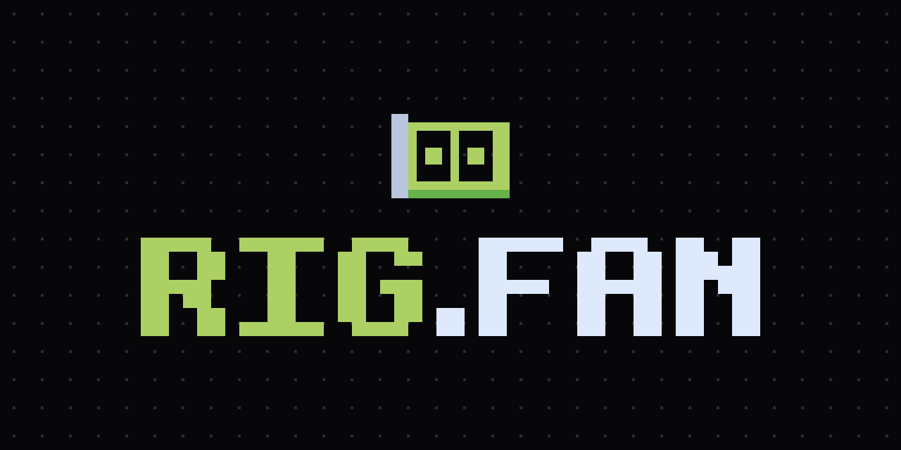

<p align="center">
  <a href="https://rig.fan"></a>
</p>

<p align="center">
  <a href="https://rig.fan"></a>
  <a href="https://x.com/rigdotfan"></a>
  
  
  
</p>

# Rig (`$RIG`)

**Mine ETH in the browser.** Open [rig.fan](https://rig.fan), press **Start**, and your GPU (WebGPU) or CPU (WASM) searches keccak shares for the current round. Every trade of `$RIG` pays a fee; 40 % of the project's part goes into the mining pool as ETH (60 % to the team, fixed in the contract), and every round splits the release between miners in proportion to work.

No NFTs. No presale. No team token allocation. Nothing to install.

## How it works

```
 trade $RIG ── 4 % fee ──▶ PONS 1 % + creator 3 % ──▶ PonsTreasury ──┬── 40 % ETH ──▶ HashMine pool
                                                                      └── 60 % ETH ──▶ team wallet    │
 browser miner ── keccak shares ──▶ HashMine ── round close ──▶ release ∝ work ◀──────────────────────┘
```

1. **Fees.** Every trade pays 4 %: the PONS base fee (1 %) plus the creator tax (3 %). About 3.7 % of volume reaches the project, in ETH.
2. **Split, not buyback.** `PonsTreasury` is the token's creator-fee recipient. `harvest()` — anyone can call it — pulls the fees from PONS and splits them by a ratio fixed at deployment (`teamBps`, immutable): **40 % to `HashMine`, 60 % to the team wallet**. Nothing is swapped, nothing is kept in between: the pool's only inflow is its share of fees (and donations).
3. **Rounds.** Every 600 s the pool releases 48 bps of its ETH to the round that just closed.
4. **Shares.** A share is a nonce with `keccak256(beneficiary ‖ challenge ‖ nonce)` under the target. It is bound to your address, so nobody can submit your work as theirs. Reward = release × your work ÷ total work.
5. **Session key.** The tab signs with a throwaway key that only pays gas. Rewards go to the beneficiary you chose.

## The miner

- **WebGPU** engine (WGSL keccak) with a **WASM** fallback (Rust), both in workers — the page stays responsive.
- **Load cap.** Never more than **50 %** of your machine: the duty cycle is measured and enforced, adjustable down to 10 %.
- **Difficulty per miner** with a gas floor: small rigs still get shares, big rigs don't spam the chain.
- Nothing leaves the tab except the shares.

## Tokenomics

| | |
|---|---|
| Launch | [PONS](https://pons.fun) on Robinhood Chain |
| Trade fee | 4 % (1 % PONS + 3 % creator) → ≈3.7 % of volume to the treasury, in ETH |
| Fee split | 40 % mining pool / 60 % team wallet — immutable in `PonsTreasury` |
| Team token allocation / reserve | 0 |
| Pool inflow | 40 % of trading fees via `PonsTreasury.harvest()`; no buyback, no swap |
| Round | 600 s, releases 48 bps of the pool |
| Rewards | ETH, proportional to work in the round |

## Layout

| Path | What |
|---|---|
| `contracts/` | Foundry: `HashMine.sol` (rounds, shares, ETH rewards), `PonsTreasury.sol` (creator-fee recipient: harvest → 40/60 split, timelocked migration) |
| `miner-wasm/` | Rust → WASM keccak share search (CPU engine) |
| `web/` | Vite + React miner: engines (WASM workers, WebGPU), controller, UI |
| `sim/` | Parameter simulation (`sim/RESULTS.md`) |
| `scripts/` | `build-wasm.sh`, `export-abi.sh` |
| `docs/` | Design spec and execution plans (`docs/superpowers/`) |

The working name `hashmine` survives in the share-pool contract `HashMine.sol`, the spec/plan file names and the WASM crate.

## Commands

```bash
# contracts
cd contracts && forge test --no-match-path 'test/fork/*'     # unit + invariants
cd contracts && forge test --match-path 'test/fork/*'        # against real PONS on a mainnet fork (drpc)
cd contracts && forge script script/Vectors.s.sol:Vectors    # cross-implementation hash vectors

# wasm + abi (after changing miner-wasm/ or contracts/src/)
scripts/build-wasm.sh
scripts/export-abi.sh

# web
cd web && npm install
cd web && npm test              # vitest (engines, policy, controller, UI helpers)
cd web && npm run test:browser  # WebGPU + WASM engines in headless Chromium
cd web && npm run test:e2e      # controller against HashMine on anvil
cd web && npm run test:e2e-ui   # the Mine/Stats/Docs pages against anvil, screenshots in web/e2e-artifacts/
cd web && npm run dev           # local dev server; pass ?chain=local&rpc=…&hashMine=0x… or set VITE_* env

# simulation
cd sim && python3 hashmine_sim.py --seed 1
```

Browser tests need the cached Chromium 1243 (`~/Library/Caches/ms-playwright/chromium-1243`) or `RIG_CHROME=<path>`; WebGPU on Metal is required for the GPU checks.

## Configuration (web)

`VITE_CHAIN` (`local` | `testnet` | `mainnet`), `VITE_RPC_URL`, `VITE_HASHMINE_ADDRESS`, optional `VITE_TREASURY_ADDRESS` and `VITE_FEE_ESCROW_ADDRESS` (enable `harvest`), `VITE_X_URL`. URL query parameters `chain`, `rpc`, `hashMine`, `treasury`, `feeEscrow`, `beneficiary` override them.

The **Token** page watches the PONS launch on Robinhood Chain mainnet regardless of the mining chain: `VITE_PONS_TOKEN` (or `?token=0x…`) and optional `VITE_PONS_RPC_URL` (`?ponsRpc=`). It shows the creator's fees waiting in the fee escrow, on the bonding curve and in the Uniswap v4 hook, plus price, market cap and graduation progress, refreshed every 3 s.

## Links

- Site: **https://rig.fan**
- X: **https://x.com/rigdotfan**
- Source: https://github.com/Ega741/rig
- Chain: Robinhood Chain (Arbitrum Orbit) · Launchpad: PONS
